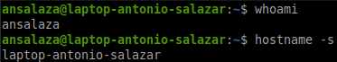
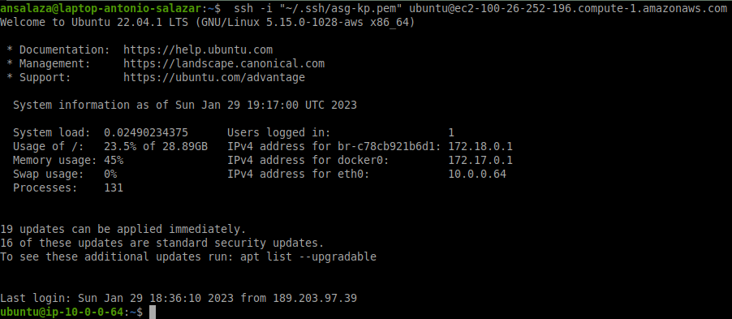
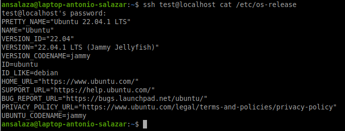
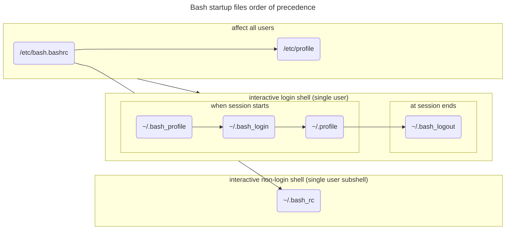

# :book: Bash Startup Files

The Bash startup files are executed when initiating a shell session.

There are different login modes.

## Interactive login shell.
  
- This mode refers to opening a local terminal in your machine or connecting to a remote one interactively. In other words, a session started after a successful login. `ssh user@host`
- Examples:

  ||
  |:--:|
  ||
  |Fig 1. - local interactive login shell|

  ||
  |:--:|
  ||
  |Fig 2. - remote interactive login shell|
    

## Interactive non-login shell.

- It consists of running a new shell session (subshell) from an interactive login shell when opening a child shell from a terminal already logged on.


    ```bash
    bash
    ```

- It also happens when running a remote shell command from your terminal.

    ```bash
    ssh test@localhost cat /etc/os-release
    ```

      ||
      |:--:|
      ||
      |Fig 3. - remote interactive non-login shell|

## Non-interactive non-login shell.

- This situation happens when running a shell script that does not need to open a new user session. It runs its subshells without logging in.

  ```bash
  ssh test@localhost cat /etc/os-release
  ```

    ||
    |:--:|
    ||
    |Fig 4. - remote interactive non-login shell|

# Bash startup files precedence

The following diagram shows the bash startup precedence on Ubuntu 22.04 system.




# :alembic: LAB

1. Create a test user.

    ```bash
    sudo useradd -m -s /bin/bash test
    sudo passwd test
    ```

2. Create a message pointing what file has been executed.

    - As `root` user add the lines below to `/etc/bashrc.bashrc` file.

    ```bash
    # TEST ONLY
    echo 'you reached /etc/bashrc.bashrc';
    ```
    
    - As `root` user add the lines below to `/etc/profile` file.

    ```bash
    # TEST ONLY
    echo 'you reached /etc/profile'
    ```

3. Open a new terminal and look for the feedback.

    ```bash
    sudo su - $USER
    ```

4. Having the terminal opened, run a subshell process and check the results.

    ```bash
    bash # hit enter
    exit # hit enter
    ```

5. Login with the test user and check the feedback.

    ```bash
    sudo su - test
    # or
    ssh test@localhost;
    # or
    ssh -l test localhost ;
    ```

6. AS `test` user create all the startup files with an echo feedback.

    ```bash
    # ~/.bashrc
    echo '# TEST ONLY' >> ~/.bashrc ;
    echo 'echo you reached ~/.bashrc' >> ~/.bashrc ;

    # ~/.bash_profile
    echo '# TEST ONLY' >> ~/.bash_profile ;
    echo 'echo you reached ~/.bash_profile' >> ~/.bash_profile ;

    # ~/.profile
    echo '# TEST ONLY' >> ~/.profile ;
    echo 'echo you reached ~/.profile' >> ~/.profile ;

    # ~/.bash_login
    echo '# TEST ONLY' >> ~/.bash_login ;
    echo 'echo you reached ~/.bash_login' >> ~/.bash_login ;

    # ~/.bash_logout
    echo '# TEST ONLY' >> ~/.bash_logout ;
    echo 'echo you reached ~/.bash_logout' >> ~/.bash_logout ;
    ```

7. Try to log in and logout again.
8. Check the script feedback.
9.  Now remove each file backwards and check the results on each step of the process.

    - Remove `~/.bash_profile`
    
    ```bash
    rm ~/.bash_profile
    ```

    - exit and login again.

    ```bash
    exit ;
    ssh test@localhost
    ```

    - Remove `~/.bash_login`
    
    ```bash
    rm ~/.bash_login
    ```

    - exit and login again.

    ```bash
    exit ;
    ssh test@localhost
    ```

- Remove `~/.profile`
    
    ```bash
    rm ~/.profile
    ```

    - exit and login again.

    ```bash
    exit ;
    ssh test@localhost
    ```

10. Remove the test user.
11. Comment or remove the lines: `# TEST ONLY` and `echo 'you reached $FILENAME` from `/etc/bash.bashrc` and `/etc/profile` files.

# References
- [gnu.org Bash manual](https://www.gnu.org/software/bash/manual/html_node/index.html#SEC_Contents)
  - [6.2 Bash Startup Files](https://www.gnu.org/software/bash/manual/html_node/Bash-Startup-Files.html)

- [Beyond Linux® From Scratch (System V Edition)](https://www.linuxfromscratch.org/blfs/view/svn/index.html)
  - [The Bash Shell Startup Files](https://www.linuxfromscratch.org/blfs/view/svn/postlfs/profile.html)